# XREngine Avatar and Scene Asset Pipeline

---

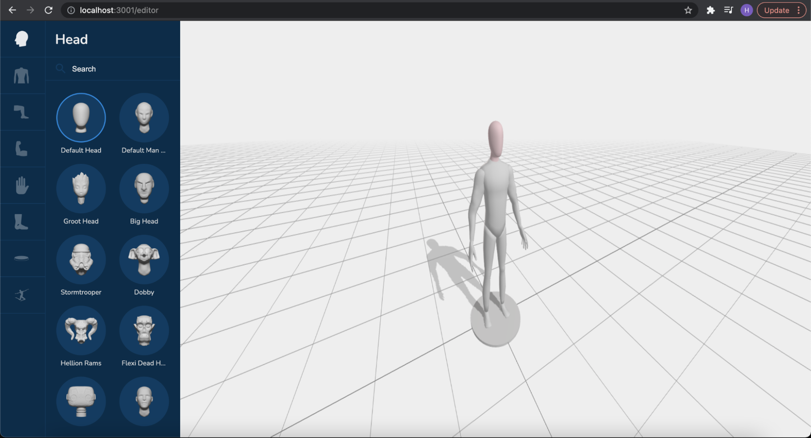
965806

XREngine ([XREnginengine/XREnginengine](https://github.com/xr3ngine/xr3ngine)) is our multiplayer web 3D framework - hosted at **[theoverlay.io](https://theoverlay.io/editor)** - Team site [lagunalabs.io](https://lagunalabs.io/)

We are building 8 demo scenes by March 10 2021, 40 scenes planned by June 2021

All scenes are published through our editor and testable as multiplayer “locations”

**Our pipeline** process:

1. Create scene in blender with colliders 
2. Export scene as GLB into XREngine Scene Editor (Spoke)
3. Publish scene to a location and test using a XREngine Location Link
4. **Listing Here [XREngine Content Tracking](https://docs.google.com/spreadsheets/d/1qPlO-5BPvj_CktauLEAr38ZtIkkJ-uduhUfyDQ1eeIQ/) - Goes into our Content Seeding System**
5. **Leadership adds your scene to a Content Pack**

**Output: EVERYONE**

Please report your scene **max texture size, glb size, scaled area size, poly count and drawcalls** with your final version. 

We will be making a final link on a XREngine server to test the scene. 

Our editor is in final development 

**USE THIS ONE**

**Production Server - Updated Weekley - Still in Beta: [https://app.theoverlay.io/editor](https://app.theoverlay.io/editor) **

**Developer Server - Updated Daily: [https://dev.theoverlay.io/editor](https://dev.theoverlay.io/editor)**

# XREngine Scene Editor

The XREngine level editor is based on Spoke ([Spoke for Mozilla Hubs](https://hubs.mozilla.com/spoke))

We have added extra features to Spoke:

* Level of Detail (Low, Med, High, Ultra)
* Interactable Objects
* Volumetric Video Objects
* Broad support for Shaders/Shadows/Lights

You can use [Spoke for Mozilla Hubs](https://hubs.mozilla.com/spoke) to test your scenes if the developer servers are not working.

We have support for **cascaded shadow maps**, it's automatic

you just need to check "casts shadows" and "receive shadows" in editor

**The number of lights is very limited, we augment our lighting with environment maps and postprocessing effects. Baking hasn’t been fully tested.**

# Blender Export

We use the same blender export tools as hubs

* Use blender 2.91
* You will need to understand how to use the environment map lighting. 
* [MozillaReality/hubs-blender-exporter](https://github.com/MozillaReality/hubs-blender-exporter) 
* Create the materials under a PBR workflow following this guide: [https://docs.blender.org/manual/en/dev/addons/import_export/scene_gltf2.html?highlight=gltf#gltf-2-0](https://docs.blender.org/manual/en/dev/addons/import_export/scene_gltf2.html?highlight=gltf#gltf-2-0)
* If you have different instances of the same static model, batch them manually and combine them as single mesh so they can be batched. If they have too many polygons, combine them on different mesh groups

[Using the Blender glTF Exporter · Hubs by Mozilla](https://hubs.mozilla.com/docs/creators-using-the-blender-gltf-exporter.html) 

*  (this is included by default on blender 2.8+)

[Trim Textures: HOW TO](https://www.polygonalmind.com/blog-posts/trim-textures-a-new-hope) 

## Target output sizes for Scene

Format GLB Max size 10 MB

**Max Texture	25 MB**

**Max Poly	300k**

**Max Verts	300k**

Use **Texture Map / Atlas ** as much as you can

Use maps at 2048^2 we allow for 1-4 2k maps for the scene - 4096^2 is usually too much for the render.

Blender Draco compression Supported for poly/vert.

## LOD Level of Detail system

* LOD is handled by engine/camera system - defined Groups
* How To Examples
    * [https://www.dropbox.com/s/zijpipsat1azaug/TestMesh_LODGroup.blend?dl=0](https://www.dropbox.com/s/zijpipsat1azaug/TestMesh_LODGroup.blend?dl=0) 
    * [https://www.dropbox.com/s/4puro5zbqnbwvjk/TestMeshWithLODGroup.glb?dl=0](https://www.dropbox.com/s/4puro5zbqnbwvjk/TestMeshWithLODGroup.glb?dl=0) 
    * 

    * Setup an empty group that is associated with the different LODs
* Target sizes
    * Ultra - 300k
    * High - 180k
    * Med - 100k
    * Low - 40k

## **Adding Colliders**

Video: [how to create XREngine colliders in blender](https://youtu.be/hj8md0hBxa8)

Reference the Rooftop / VR Golfl

Needs better Script Automation

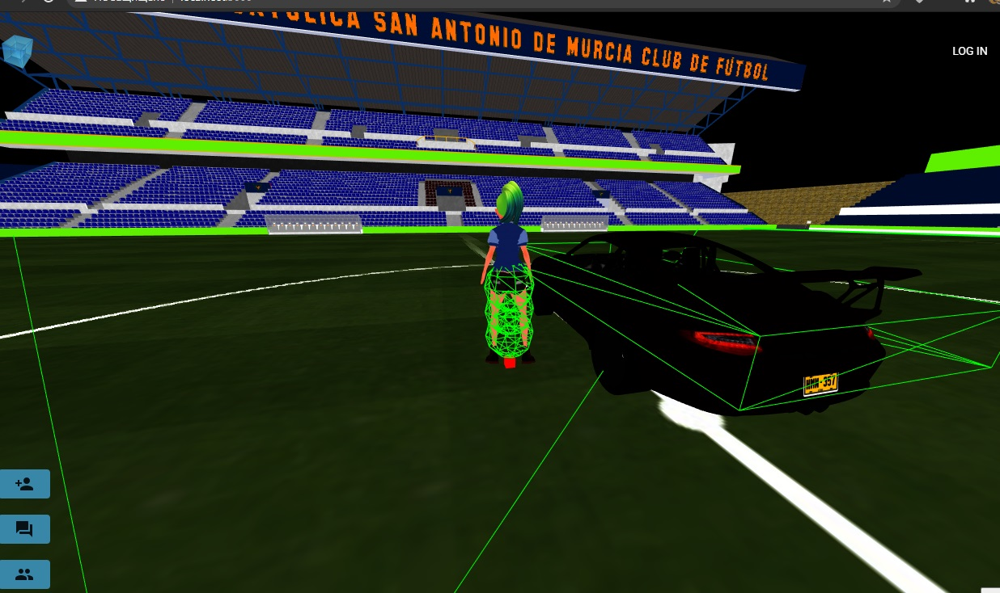
   

* Box colliders.

    To add these add a cube, move, rotate and scale the cube in object mode. Do not add a material to the collision object. Do not move the vertex of the cube in edit mode. Set custom properties to type = box. Don’t use type=obstacle unless you have express authorization from the engineers.

* Trimeshes.

    To add these simply create a mesh and triangulate it. It's not mandatory that the trimesh needs to be a closed mesh. Apply scale and rotation. Check the normals direction, must point out on the collider direction. Needs to be below 255 vertices. Decimate if needed. Do not add a material to the collision object. Set custom properties to type = trimesh.

Group colliders by similarity (ie: environment, objects, boxes, trimshes, ect..) and parent them to an appropriately named empty,

The group node must have Custom Properties set to xrengine.collider.bodyType = 0 and xrengine.entity = can be named anything

The children nodes act as shapes of the body, and do not need the xrengine.collider prefix, but must have the type property set to one of box, ground, sphere, capsule, convex, trimesh

For each shape object, there are additional optional properties:

bodyType: number: 0 (static), 1 (dynamic) - (default = 0)

isTrigger: boolean (default = false)

staticFriction: number (default =0)

dynamicFriction: number(default = 0)

restitution: number(default = 0)

collisionLayer: number (default = 19)

collisionMask: number(default = 1)

contactOffset: number (default = 0)

restOffset: number (default = 0)

Any box or capsule shaped colliders used to only block the player should be instead type = obstacle. If made an obstacle, optional properties do not apply.

**To assign properties to parent object of the type:**

_import bpy_

_objs = bpy.context.view_layer.objects.selected_

_for obj in objs:_

_obj[“xrengine.collider.bodyType”] = 0_

_obj[“xrengine.entity”] = “chooseaname”_

**To assign properties to each of the childs:**

_import bpy_

_objs = bpy.context.view_layer.objects.selected_

_for obj in objs:_

_obj[“type”] = “_box or ground or sphere or capsule or convex or trimesh”

The 2 most used are box, obstacle and trimesh.

**Replaces all selected object's custom properties tags and replace it with the active object's custom properties:**

_import bpy_

_ob_sel = bpy.context.selected_editable_objects_

_ob_act = bpy.context.object_

_props = ob_act.keys()_

_print(props)_

_for ob in ob_sel:_

_if ob == ob_act:_

    _Continue_

_for key, value in ob.items():_

    _print('removed', key, value)_

    _del ob[key]_

_for p in props:_

    _print('set', p, ob_act[p])_

    _ob[p] = ob_act[p]_

 - adjusted the mixing of the rotation position and the scale of the Model + parameters of the editor. For all colliders, and types of creation.

 - set up spawn points to work on the server and change not transform, but capsula.body. Without transforming packets, the client character will appear at x0 y0 z0. The server corrects it to spawn point .

(Since this will immediately show whether there is a connection to the server, if the location on the server has not started, we will appear at the 0 coordinate.)

 - If the character is in the fall for some time, server teleports him to the spawn point

 - Correctly added the network correction component to the character prefab.

 - Portals works now from model user.data

Always export colliders with the rest of the meshes.

Using _xrengine.entity_ on the root collection allows the editor node entity to have the components and loaders specified in custom properties applied instead of creating a new entity \

**_We need the code to remove all properties for a selection of objects._**

## Interactable objects

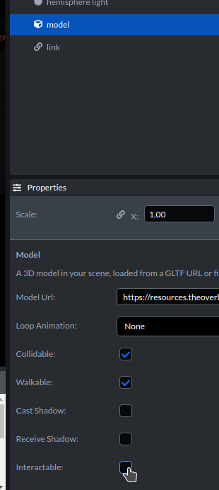

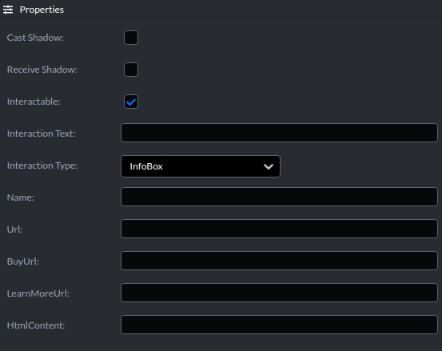

## Tips

**Box players into playspace with colliders**

Bloom support - use the standard bsdf node

**Prefered settings to create lightmaps:**

Image size: up to 2048.

Pack quality 48 (maximize the UV space)

Margin 0.2 (to eliminate seams)

Share texture space selected allows multiple objects to use the same UV space. This is handy to separate the objects in different collections, but in my opinion I think that it is better to keep all the meshes that will be using a single lightmap in a single object.

-Typical set up of materials in Blender. Principled shader allows use of PBR textures (albedo, metallic, roughness and normal). Is ok to input values as parameters. Avoid using metallic and roughness maps. Keep texture usage at a minimum. Any node between the texture and the input would be ignored by the engine.

If maximum performance want to be achieved use this workflow for creating assets. Bake AO, Metal and Roughness maps into single map on seperate channels where Red channel is AO, Green channel is Roughness, and Blue channel is Metal

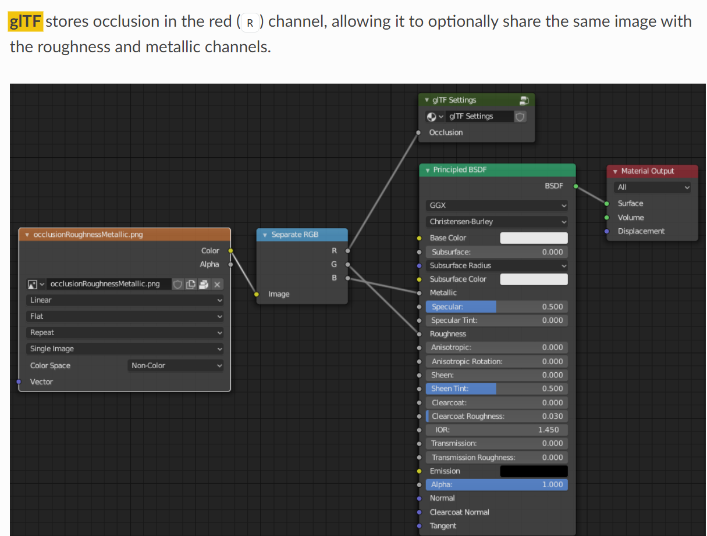

Quixel mixer usage is advised to achieve this type of result.

-Baking setup with only 1 UV map. Plug directly the image instead of principled shader, but it will be an “unlit” material without the ability to include any other maps than albedo. This is useful to get baked shadows with very low performance impact. Use baking for all materials that are not rough or emissive.

Alternative setting (seen in apartment.glb):

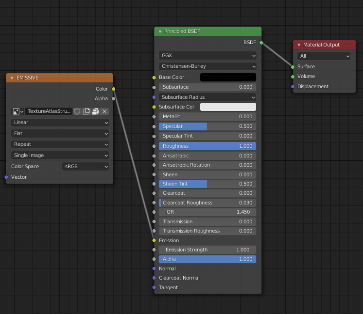

-Baking setup with only 2 UV maps. MOZ_lightmap intensity needs to be set between 1 and 5 in order to achieve good results in natural light environments. We don’t recommend this type of workflow. Yea 
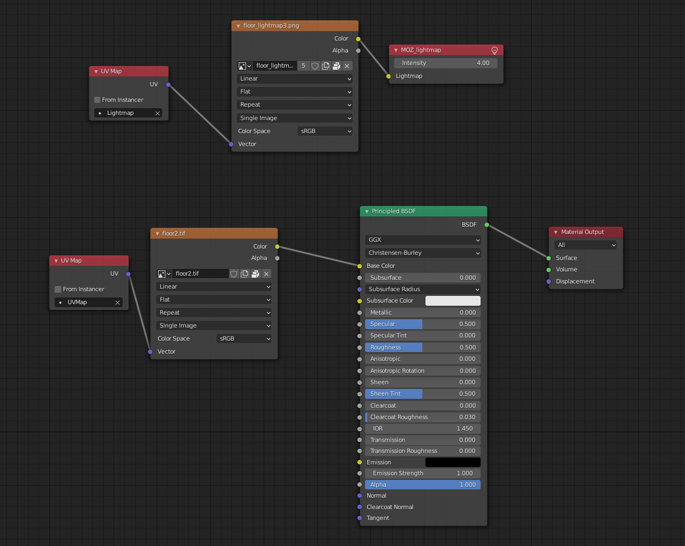

-combined map. Bake type: combined. Influence: direct, indirect, diffuse and ambient occlusion. Diffuse bake only with direct and indirect can be used but we will lose the ambient occlusion information.

-Denoise nodes are use to remove artifacts

-The combined map has to be desaturated (that’s because how blender bakes the combined  and as we increase the intensity on the moz parameter it has to be clamped with RGB curves.

-to increase intensity of the shadows, simply reduce the environment intensity on the global settings.

Using the cubemap skybox modifies the influence of lightmaps and it's hard to correct. With MOZ_influence = 1:

NO shadows.

With MOZ_influence = 4

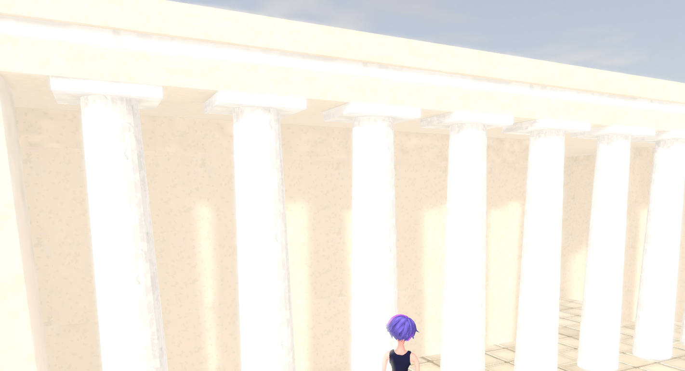

Overblown highlights

Using cubemap bridge seems to be more balanced. Shadows are rendering properly, but the floor Is overexposed MOZ_influence = 4

## **Asset workflow using Substance Painter**

File structure:

* Root. Contains source blend file and the substance painter project
* /FBX. Contains source FBX files for Painter
* /GLB. Contain final output, engine-ready
* /GLB Textures. Contains Painter export maps used to create the GLB.
* /Previews. Images for marketing porpoises/work previsualization.
* /Textures. Textures used as input for creating the asset

PBR Roughness - Metallic workflow will be used.

Texture sets will be used at discretion. We need to keep texture sets at a minimum to create performant assets. For cryptosabers 3 texture sets will be used. Each texture set will be represented as a different mesh in blender.

Meshes will be created in 2 different meshes complexities. All of them should be inside a blender collection called [NAME]_source.

High poly will be the source mesh. It doesn’t need to be UV unwrapped. It will be splitted into different materials.

Example.

This will be used to bake the ID map in Painter. The mesh needs to be named as: [NAME]_high

Low poly. Is an optimized version of the high poly one. This will be the main file that we are going to work on painter and will be finally delivered on the GLB. It needs to be properly UV unwrapped (use UVPackmaster2). Also, all materials should be erased except 1 that should be named as [NAME]. The mesh needs to be named as: [NAME]_low

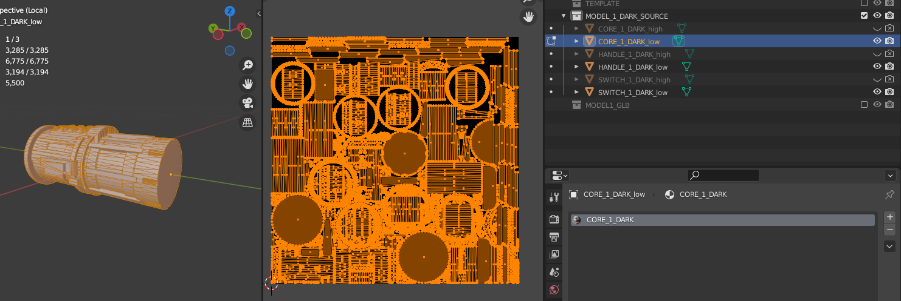

Once this is done, both files will be exported as FBX. After that, _low file will be used to create a new project in painter with the following settings:

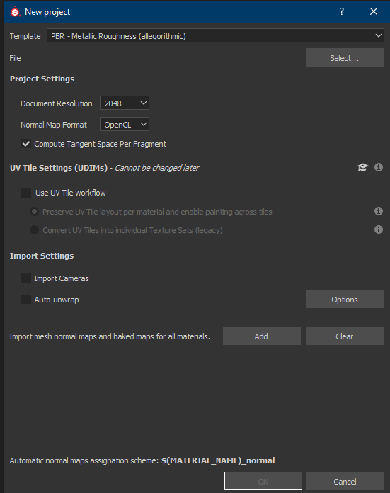

After this ID baking should be carried on. Load the high poly mesh FBX on the “high definition meshes” and use the following settings to create the ID. Note: is possible that the map is not 100% properly baked and it will need further retouches to iron out little mistakes.

 
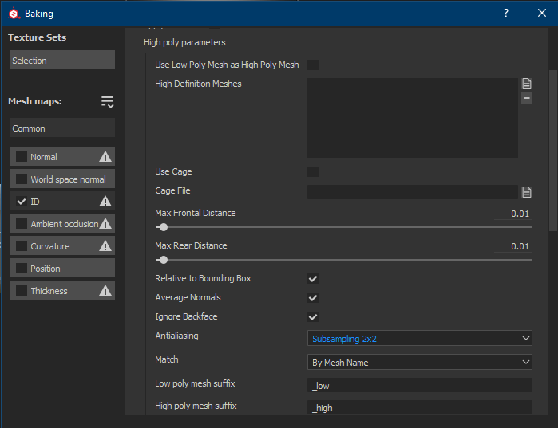

Then World space normal, ambient occlusion, curvature and position can be baked using the same _low mesh as source, unless _high contains details that it is wanted to be used in the project. Use the tool at your discretion. 

The different textures set will be gathered from the different meshes. With the color selection mask it is possible to assign different materials to each of the sets using the ID mask baked.

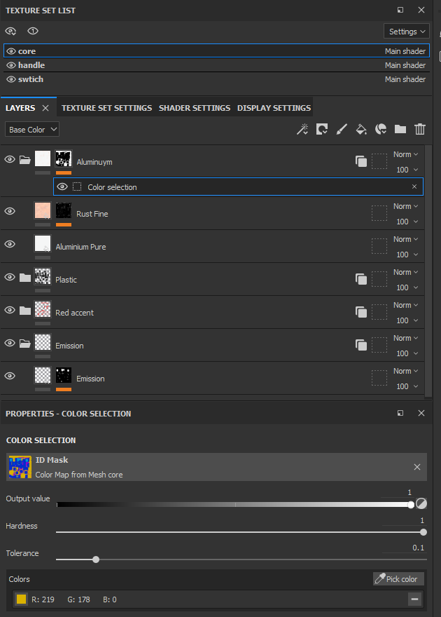

When exporting the maps for GLTF usage, please generate the maps as following. Export them to the /glbtextures folder.

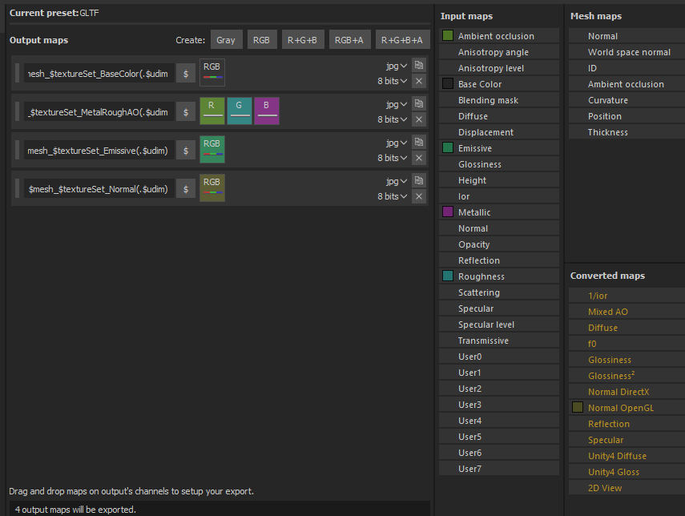

Once this is done, put the_low meshes inside a new collection called [NAME]_GLB. Assign the textures sets to the meshes following this shader configuration. 

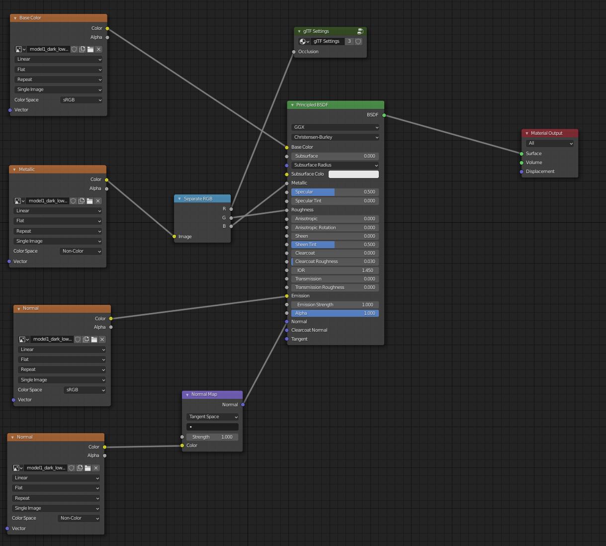

Export the meshes as a new GLB file (production ready).

## **Preparing assets to use GPU instancing**

* If the asset has different objects, join them all together (preferred) or parent them all to a single empty object.
* If the asset has different materials, bake all the materials into a single material (preferred) or separate the meshes by material.
* Use blender instance tool (duplicate using alt+D). Also known as duplicate linked.

    
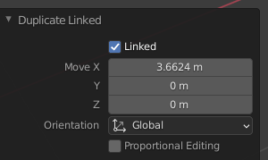

## Other

**Characters are going to target 1.6-1.8M tall**

**Standardize scale in Blender and Spoke across all scenes. 1 = 1M **

**Uvs must be clean without overlapping, you can use mapping nodes in blender to add tiling textures instead of scaling Uvs. Use the UVPackmaster for asset creation and baking preparation to optimize as much as possible the UV space.**

**Keep naming tidy and clean the geometry as much as possible.**

### Blender Mixer - Collaboration Tools 

[https://gitlab.com/ubisoft-animation-studio/mixer#introduction](https://gitlab.com/ubisoft-animation-studio/mixer#introduction) 

### Alt Lightmap Tools 

* [Shahzod114/Blender-BakeLab2: Blender addon for baking images](https://github.com/Shahzod114/Blender-BakeLab2)
* Bake Wrangler [Bake Wrangler Addon (free)](https://www.blendernation.com/2020/02/07/bake-wrangler-addon-free/) This is broken for baking combined lightmaps!
* UV textools [https://blender-addons.org/textools-addon/](https://blender-addons.org/textools-addon/)

### Better FBX (Ask Liam for License) [Better FBX Importer & Exporter](https://blendermarket.com/products/better-fbx-importer--exporter) 

Unreal > Spoke

[glTF Exporter in Code Plugins - UE Marketplace](https://www.unrealengine.com/marketplace/en-US/product/gltf-exporter#) 

### Unity > Blender

[Unity-Technologies/MeshSyjkncDCCPlugins: ](https://github.com/Unity-Technologies/MeshSyncDCCPlugins)

[DCC plugins for MeshSync in Unity. ](https://github.com/Unity-Technologies/MeshSyncDCCPlugins)

[Supported tools: Maya, Maya LT, 3ds Max, Motion Builder, Modo, Blender, Metasequoia](https://github.com/Unity-Technologies/MeshSyncDCCPlugins)

OTHERS: blender GIS https://github.com/domlysz/BlenderGIS, F2 loops tools, bool tool, node wrangler, simple lattice, 

Hubs blender exporter: https://github.com/MozillaReality/hubs-blender-exporter  

Adding a folder Creator Scenes\998_tools_addons with the tools. I can put all the free addons over there

# Create Test Location of Scene in XREngine

1. Save in Editor. **[https://dev.theoverlay.io/editor](https://dev.theoverlay.io/editor)**
2. [https://dev.theoverlay.io/admin](https://dev.theoverlay.io/admin) 
3. Create a new location
4. https://dev.theoverlay.io/location/{{LOCATION NAME}} - one word or use ‘-’ or  ‘_’

# 
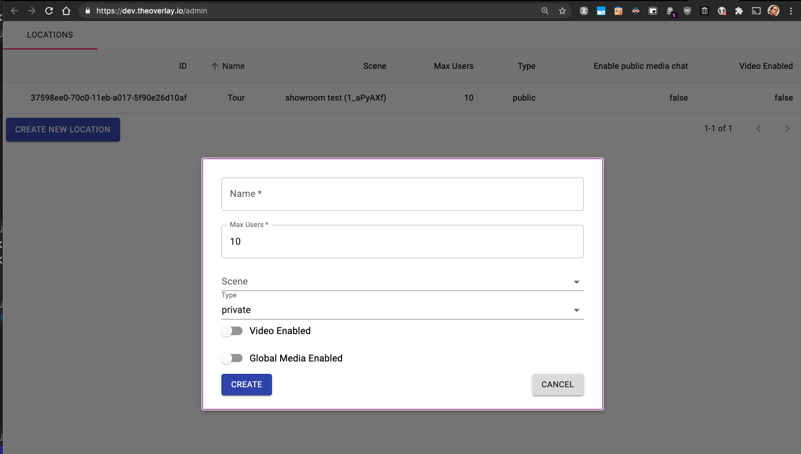

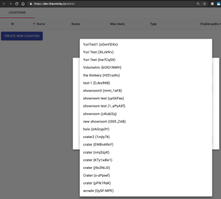

# Cubemaps/Environment maps

XR also supports 360 equirectangular images as source. Just select it from the type from the combo box.

To render out equirectangular maps from developed scenes set up the camera inside blender with these settings:

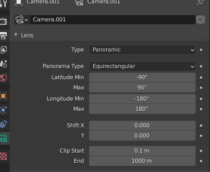

Workflow for cubemaps. Depreciated.

1. Use [https://matheowis.github.io/HDRI-to-CubeMap/](https://matheowis.github.io/HDRI-to-CubeMap/) to create the cubemap files from a 360 equirectangular image (either HDR or not). Set size to 1024px.
2. Convert the output images are on jpg format
3. Rename the files from the output as following:
    1. Cube_tile_0001 -> negx.jpg
    2. Cube_tile_0002 -> negz
    3. Cube_tile_0003 -> posx
    4. Cube_tile_0004 -> negy
    5. Cube_tile_0005 -> posy
    6. Cube_tile_0006 -> posz
4. Upload the folder containing them to the project via the editor your local file system
5. Set ‘Texture’ parameter on skybox to the path of the folder as above

Skybox controls the background:

Envmap within the scene properties controls the envmap intensity.

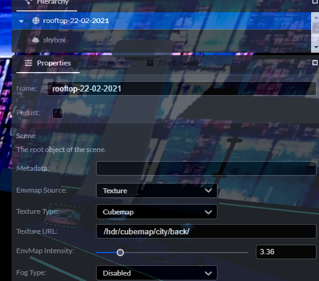

**List of ready to use cubemaps/environment maps URLs:**

* blackSun:: /hdr/cubemap/BlackSun/
* bridge:: /hdr/cubemap/Bridge2/
* Rooftop environment map (city):: /hdr/cubemap/city/back/
* Rooftop background (city):: /hdr/cubemap/city/env/
* Arcade:: /hdr/cubemap/CtrlArcade/
* GlobeTheatre:: /hdr/cubemap/GlobeTheatre/
* GreekForum:: /hdr/cubemap/GreekForum/
* MilkyWay:: /hdr/cubemap/MilkyWay/
* Park2:: /hdr/cubemap/Park2/
* MilkyWay:: /hdr/cubemap/MilkyWay/
* ShoppingDistrict:: /hdr/cubemap/ShoppingDistrict/
* MilkyWay:: /hdr/cubemap/MilkyWay/
* Holo VIP:: /hdr/envmap/HoloVip/holovip.jpg

Adding new cubemaps/envmaps:

Drag and drop the image/model/audio in the viewport then open the filebrowser and right click the icon then press copy url or place the item. Important: You will have to save the scene otherwise assets will not come up in filebrowser next time you open the project and will become garbage in server(because deletion is turned off)

# Avatar Workflow 

## TODO: ADD  

We use the Mixamo (future VRM) standard for Avatars

[infosia/avatar-asset-pipeline: Avatar asset pipeline is a tool to create continuous integration build pipelines for 3D avatar assets using set of common transformation logic as a component, such as "A-pose to T-pose".](https://github.com/infosia/avatar-asset-pipeline)  \

[Rokoko/rokoko-studio-live-blender: Rokoko Studio Live plugin for Blender](https://github.com/Rokoko/rokoko-studio-live-blender) 

* [How to make VRM file](https://vrm.dev/en/how_to_make_vrm/) 
* [VRM applications](https://vrm.dev/en/vrm_applications/#plug-in) 
* [VRM importer, exporter and utilities for Blender](https://github.com/saturday06/VRM_Addon_for_Blender)
* [Blender - Import VRM file](https://styly.cc/tips/blender-modeling-vrm/) tutorial
* [VRM Project コンソーシアム](https://vrm-consortium.org/)
* VRM [Vroid Studio to Unreal Engine 4 - Full Lifehack Tutorial](https://www.youtube.com/watch?v=lp35XeDqXP4) 
* [Converting an avatar tojkjk VRM format · GitHub](https://gist.github.com/emilianavt/51d8399987d67544fdebfe2ebd9a5149) 

In the avatar folder in dropbox we will have 4 subfolders that will contain each of the files for each step.

[https://www.dropbox.com/sh/kfzksvu9egfehmf/AADNJkXdpr50nynaekyxKrKxa?dl=0](https://www.dropbox.com/sh/kfzksvu9egfehmf/AADNJkXdpr50nynaekyxKrKxa?dl=0)

## Step 1 Prepare Avatar

In the input will be placed the input obj/fbx/glb file of the avatar with the materials, with the head and the body meshes separated. Check that face blendshapes exist. The blend file is without armature and ready to pass it to mixamo (deleting all vertex weights on the process). Optimize vertex count (delete invisible meshes). Optimize materials, try to only leave albedo map on the PBR workflow. Export on FBX to mixamo. Double check that materials are present on the model. Bake all the textures in head and body only. Keep normal maps if they are really important. Resize textures to 1K. **_Separate the head mesh from the rest of the body. _**

All these files should be placed on the input folder.

Name the files as ID + Name

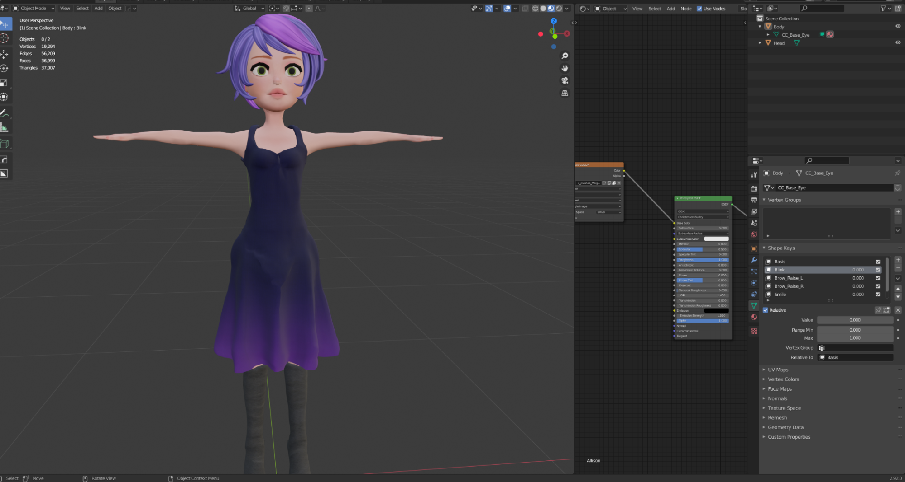

## Step 2 Rig in Mixamo Autorigger

Import the FBX to mixamo. Use autorigger.

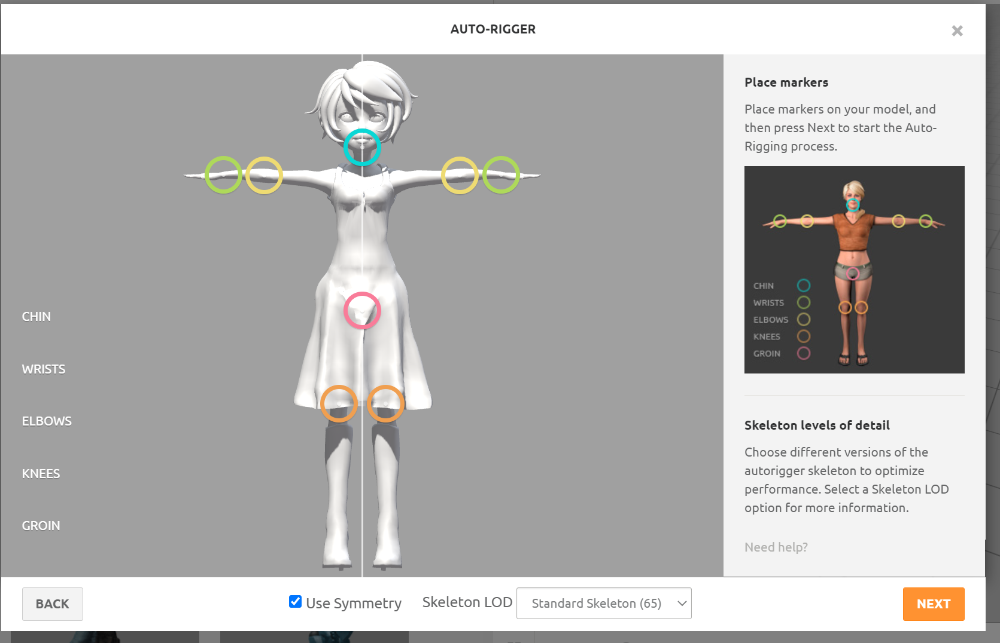

Download the FBX model as soon the autorigger has finished its work. Save the file on the Mixamo output folder.

## Step 3 Save Masters to Storage

Save as copy on the Blender rig optimized folder the blend file. Import the avatar from mixamo and use mixamo plugin to fix the armature. Replace the materials of the newly imported armature w/meshes from the original avatar. Delete the original model. Check functionality of the blendshapes/materials. Purge unused data and save the blend file again.

## Step 4 Test

Test animations via loading in a content pack and trying actions.

## Step 5 Export to Content Pack

Export the avatar to GLB. Save it in the 4. GLB ready for production folder. Use the following settings. Avoid using draco compression. Don’t export animations.

# Assets In Progress

## **[Content Tracking](https://docs.google.com/spreadsheets/d/1qPlO-5BPvj_CktauLEAr38ZtIkkJ-uduhUfyDQ1eeIQ/edit#gid=536379645)**

[Trello of Creator Scenes](https://trello.com/b/qjPNMNk1/xr-engine-creator-scenes)   \
 \
 \
1. Models must be in polygon forms, they are trangulated on export, polygons can easily edited and adjusted and better when layouts UVs

2. Uvs must be clean without overlapping, you can use mapping node in blender to add tiling textures instead of scaling Uvs.

3. Bake AO, Metal and Roughness maps into single map on seperate channels where Red channel is AO, Green channel is Roughness, and Blue channel is Metal

4. Every single asset must follow a certain naming convension . like ModelName_MeshName, ModelName_TexutreType.jpg , ModelName_mat...etc, you can use any naming convension you need

5. Batch manually similar object in to single mesh, in such situation, their UV channel 1 will have a similar UVs but overlapped, it will looks like a single uV, in such case its normal, bec you will do another UV channel for light baking where you unfold them all and make them ready for light baked

6. Clean Geometry , Clean Geometry , Clean Geometry 

7. Same as No.6

8. Physics objects colliders, remove all the materials information from them, make them all use single material, 

9. I still insisted on the current physics colliders are too much and overkill , I wont setup them like that on any game engine. fewer the better , and better to be editable and extended later.

10. No need to use any LODS, it’s overkill for target platform, use atlas instead for simulating Leafs and plants.

Those guide is what well known as industry standard, I'm  being in  industry for +4 years, including integration assets for HondaDreamDrive "Octonuts experience", you are developer so you know OOP has standard principles "SOLID", this is the equivalent for asset integration, and current integration pipeline lake of that. 
